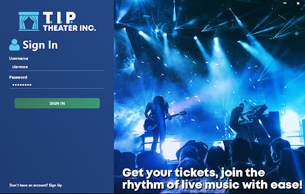
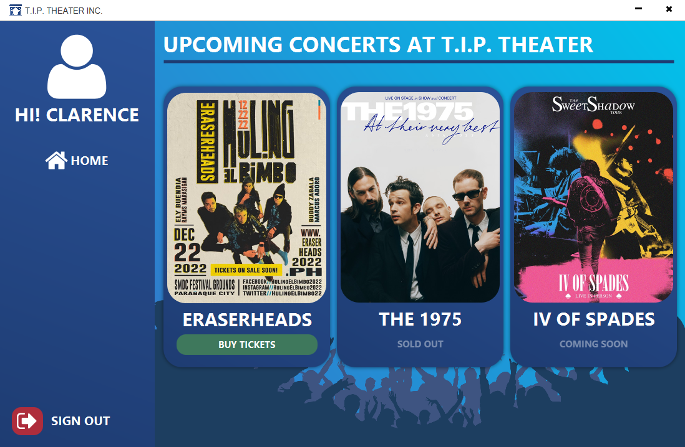
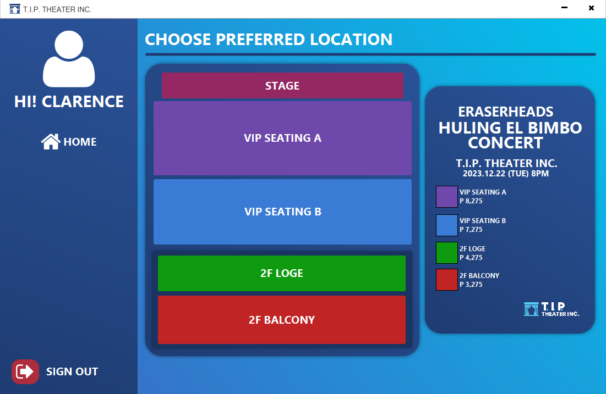
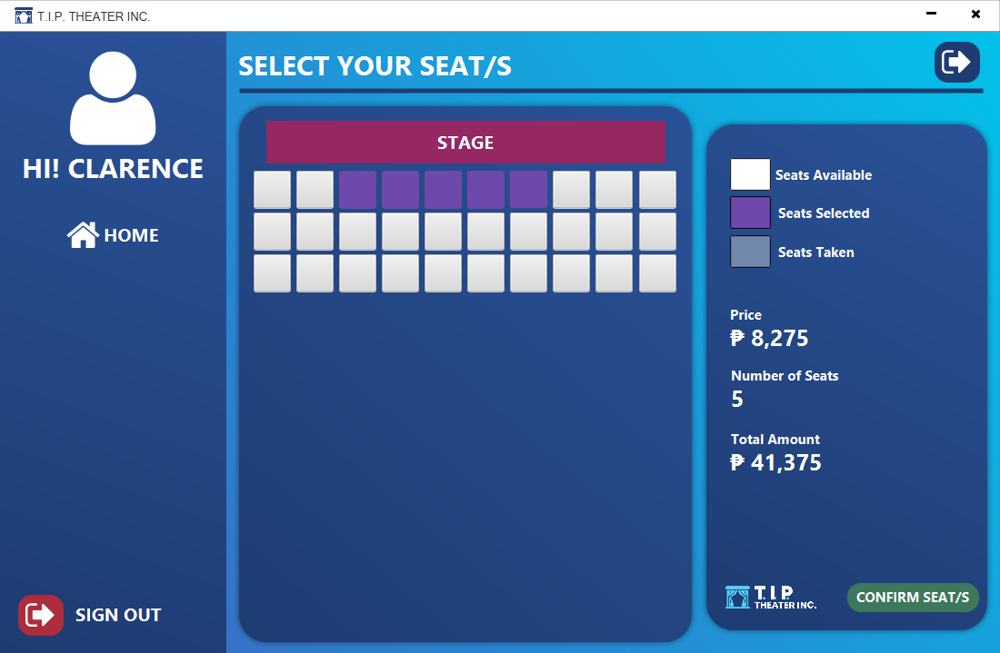
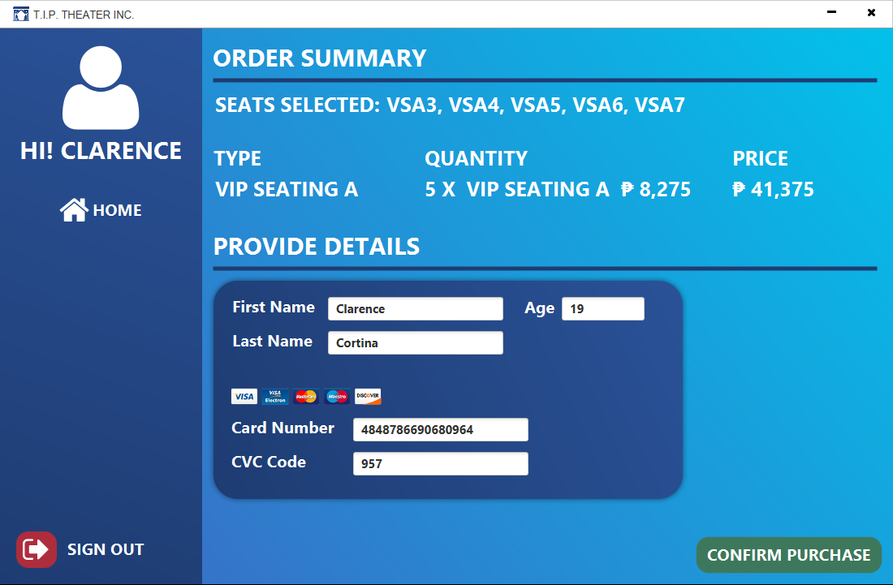
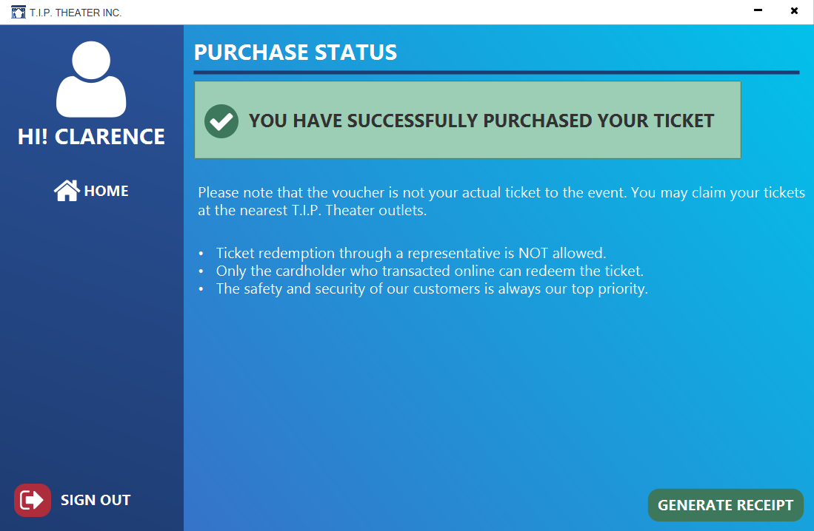
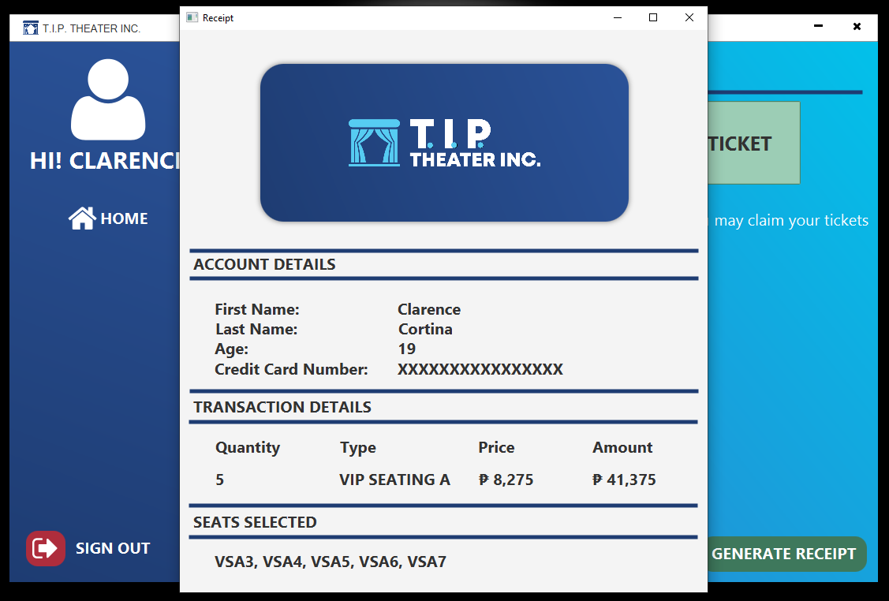
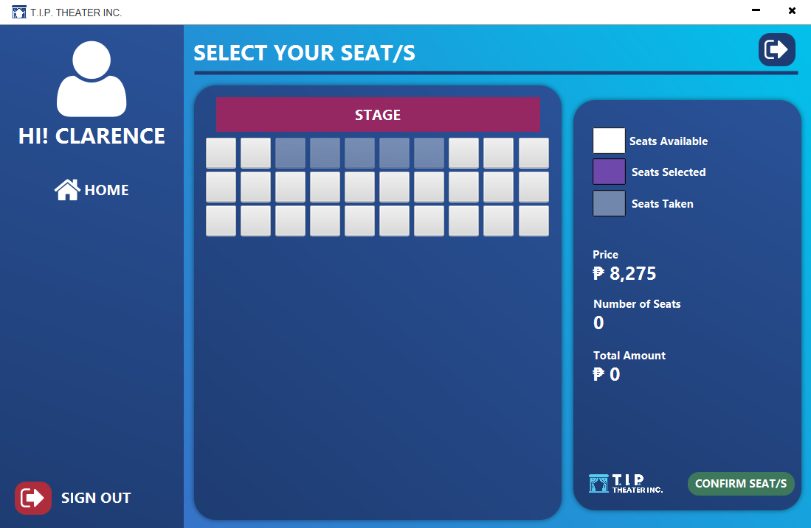

# Concert Ticket Acquisition System

## Overview
It is a desktop-based transaction-processing application designed to facilitate the online purchase and management of concert tickets. The system provides a centralized platform that enables users to browse events, select seats or ticket quantities, and complete purchases. The application is developed using Java with JavaFX as the graphical user interface framework, leveraging its modern UI components and enhanced performance for desktop environments.

## Screenshots
### Sign Up Form

  

### Sign In Form

  

### Home Page

### Location Selection Page

### Seat Selection Page

### Order Summary and Payment Page

### Purchase Status Page

### Generated Receipt

### Updated Seat Selection Page

## Technology Stack
- **Frontend:** JavaFX
- **Backend:** Java
- **Database:** MySQL (managed via XAMPP)
